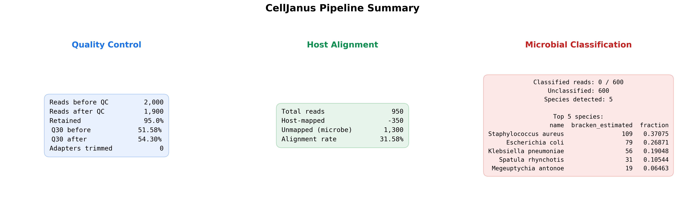
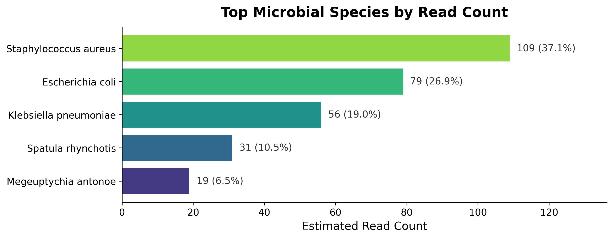
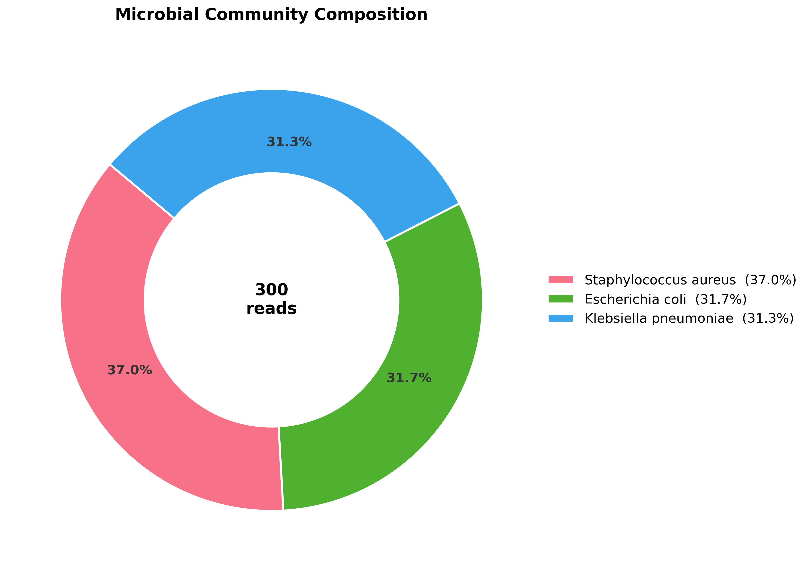
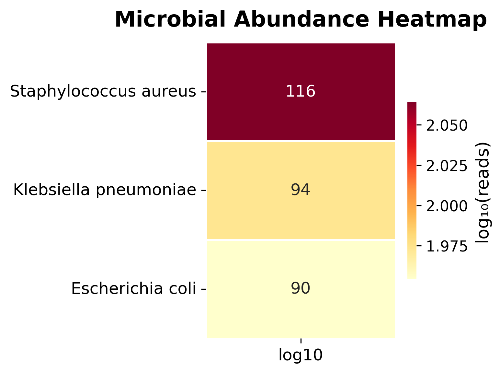
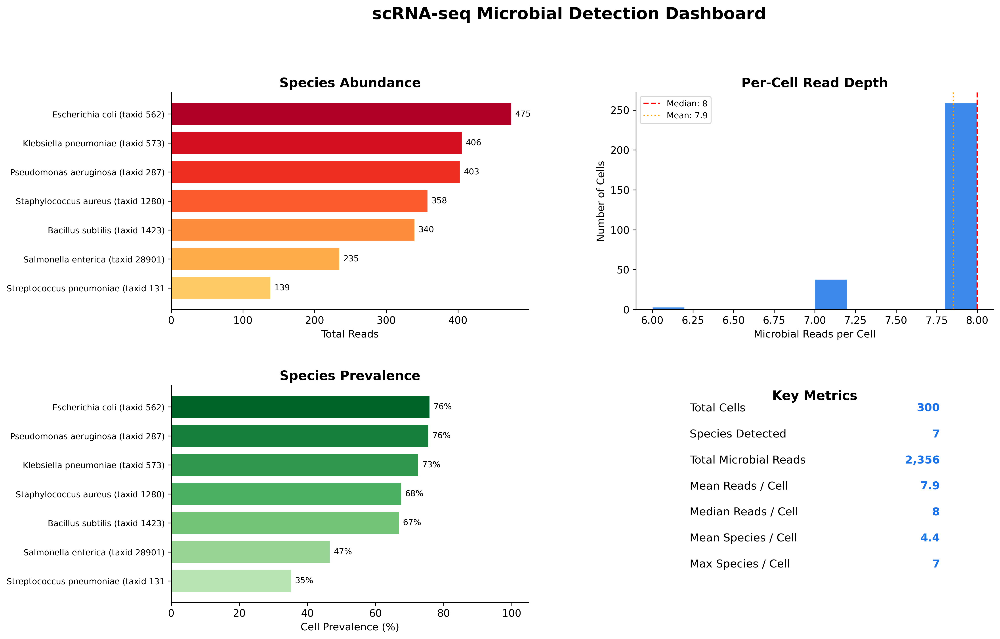
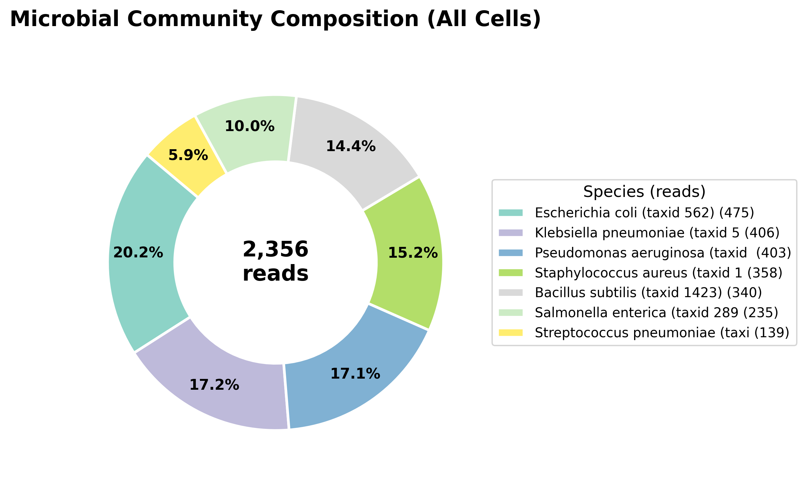
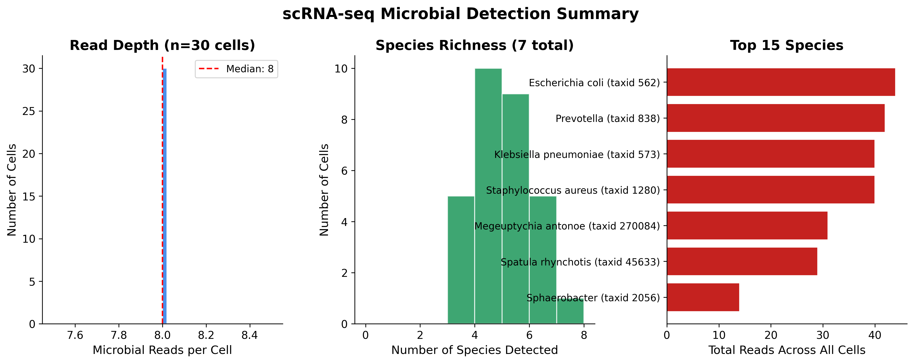

# CellJanus: Dual-Perspective Deconvolution of Host and Microbial Transcriptomes from FASTQ Data

[](https://pypi.org/project/celljanus/) [](LICENSE) [](https://github.com/zhaoqing-wang/CellJanus/blob/main/pyproject.toml) [](https://pypi.org/project/celljanus/) [](https://github.com/zhaoqing-wang)

## Overview


CellJanus is a Python-based computational framework for the joint deconvolution of host and microbial transcriptomes directly from raw FASTQ data. CellJanus addresses two complementary analytical scales: **bulk RNA-seq** for sample-level microbial profiling and **scRNA-seq** for cell-resolved microbiome characterization. Notably, the single-cell mode assigns microbial taxonomic labels to individual cell barcodes, enabling the construction of per-cell abundance matrices (cells × species) that can be seamlessly incorporated into standard downstream frameworks such as Seurat and Scanpy. This dual-perspective design bridges the gap between bulk metatranscriptomics and single-cell host–microbe interaction analysis within a single, reproducible toolkit.

## Table of Contents

1. [Preparation](#1-preparation)
    - [1.1 Installation](#11-installation)
    - [1.2 Verify Installation](#12-verify-installation)
    - [1.3 Download Reference Databases](#13-download-reference-databases)
2. [Bulk RNA-seq Mode](#2-bulk-rna-seq-mode)
    - [2.1 Quick Test](#21-quick-test)
    - [2.2 Real Data](#22-real-data)
    - [2.3 Advanced Options](#23-advanced-options)
3. [scRNA-seq Mode](#3-scrna-seq-mode)
    - [3.1 Quick Test](#31-quick-test)
    - [3.2 Real Data (10x Genomics)](#32-real-data-10x-genomics)
    - [3.3 Other Platforms](#33-other-platforms)
    - [3.4 Downstream Integration (Seurat / Scanpy)](#34-downstream-integration-seurat--scanpy)
    - [3.5 Output Files](#35-output-files)
4. [CLI Reference](#4-cli-reference)
5. [Python API](#5-python-api)
    - [5.1 Bulk Pipeline](#51-bulk-pipeline)
    - [5.2 scRNA-seq Pipeline](#52-scrna-seq-pipeline)
6. [Output Structure](#6-output-structure)
7. [Citation](#7-citation)
8. [License](#8-license)
9. [Contact](#9-contact)

---

## 1. Preparation

### 1.1 Installation

Clone the repository and create a complete environment with CellJanus **and all external tools** (fastp, Bowtie2, samtools, Kraken2, Bracken):

```bash
git clone https://github.com/zhaoqing-wang/CellJanus.git
cd CellJanus
conda env create -f environment.yml
conda activate celljanus
```

> **Requirements**: [Conda](https://docs.conda.io/en/latest/miniconda.html) or [Mamba](https://mamba.readthedocs.io/). Works on **Linux / macOS / WSL2**.

This is the **recommended** method. The repository includes test data (`testdata/`) and test reference databases so that Quick Tests ([§2.1](#21-quick-test), [§3.1](#31-quick-test)) can be run immediately without downloading any external references.

<details>
<summary><b>Alternative installation methods</b></summary>

The alternatives below install CellJanus **without** the test data and test reference databases. Quick Tests ([§2.1](#21-quick-test), [§3.1](#31-quick-test)) will not work unless you also clone the repository separately.

```bash
# Option 1: Conda from URL (no git clone needed, but no testdata)
conda env create -f https://raw.githubusercontent.com/zhaoqing-wang/CellJanus/main/environment.yml
conda activate celljanus

# Option 2: pip only (requires fastp, bowtie2, samtools, kraken2, bracken already on PATH)
pip install celljanus

# Option 3: Docker
docker build -t celljanus . && docker run --rm celljanus celljanus check
```

</details>

### 1.2 Verify Installation

```bash
celljanus check   # All tools should show ✔ Found
```

<details>
<summary><b>Check Expected Output</b></summary>

```
   ____     _ _     _
  / ___|___| | |   | | __ _ _ __  _   _ ___
 | |   / _ \ | |_  | |/ _` | '_ \| | | / __|
 | |__|  __/ | | |_| | (_| | | | | |_| \__ \
  \____\___|_|_|\___/ \__,_|_| |_|\__,_|___/
  Dual-Perspective Host–Microbe Deconvolution

                     External Tool Availability
┏━━━━━━━━━━━━━━━━━━━━━━━━━━┳━━━━━━━━━┳━━━━━━━━━━━━━━━━━━━━━━━━━━━━━━━━━━━━━━━━┓
┃ Tool                     ┃ Status  ┃ Path                                   ┃
┡━━━━━━━━━━━━━━━━━━━━━━━━━━╇━━━━━━━━━╇━━━━━━━━━━━━━━━━━━━━━━━━━━━━━━━━━━━━━━━━┩
│ fastp                    │  Found  │ /path/to/envs/celljanus/bin/fastp      │
├──────────────────────────┼─────────┼────────────────────────────────────────┤
│ bowtie2                  │  Found  │ /path/to/envs/celljanus/bin/bowtie2    │
├──────────────────────────┼─────────┼────────────────────────────────────────┤
│ bowtie2-build (optional) │  Found  │ /path/to/envs/celljanus/bin/bowtie2-b… │
├──────────────────────────┼─────────┼────────────────────────────────────────┤
│ samtools                 │  Found  │ /path/to/envs/celljanus/bin/samtools   │
├──────────────────────────┼─────────┼────────────────────────────────────────┤
│ kraken2                  │  Found  │ /path/to/envs/celljanus/bin/kraken2    │
├──────────────────────────┼─────────┼────────────────────────────────────────┤
│ bracken                  │  Found  │ /path/to/envs/celljanus/bin/bracken    │
└──────────────────────────┴─────────┴────────────────────────────────────────┘
All tools available!
```

</details>

### 1.3 Download Reference Databases

**Bulk RNA-seq** requires both a host genome index and a Kraken2 database. **scRNA-seq** only requires a Kraken2 database.

```bash
celljanus download hg38 -o ./refs           # hg38 FASTA (~940 MB) + Bowtie2 index (~3.7 GB)
celljanus download kraken2 -o ./refs        # Kraken2 standard_8 DB (~5.9 GB)
```

*Note: The test data (`testdata/`) and test reference databases are included in the GitHub repository and can be used without downloading any additional references. If you installed via the recommended `git clone` method ([§1.1](#11-installation)), the Quick Tests are ready to run immediately. If you installed via pip or conda from URL, `testdata/` will not be available.*

<details>
<summary><b>Download Expected Result</b></summary>

```
refs/
├── hg38.fa.gz                              # hg38 genome FASTA
├── GRCh38_noalt_as.zip                     # (downloaded archive, can be deleted)
└── bowtie2_index/GRCh38_noalt_as/          # Pre-built Bowtie2 index
    ├── GRCh38_noalt_as.{1,2,3,4}.bt2
    └── GRCh38_noalt_as.rev.{1,2}.bt2
```

The Bowtie2 index prefix for downstream commands is: `./refs/bowtie2_index/GRCh38_noalt_as/GRCh38_noalt_as`

</details>

---

## 2. Bulk RNA-seq Mode

Full pipeline: QC → Host alignment → Microbial classification → Visualization.

```
FASTQ → fastp (QC) → Bowtie2 (host) → unmapped reads → Kraken2+Bracken → plots + CSV
```

### 2.1 Quick Test

Run immediately with built-in test data — **no downloads required**:

```bash
celljanus bulk \
    --read1 testdata/reads_R1.fastq.gz \
    --read2 testdata/reads_R2.fastq.gz \
    --host-index testdata/refs/host_genome/host \
    --kraken2-db testdata/refs/kraken2_testdb \
    --output-dir test_results/bulk
```

> **Note**: These commands use relative paths and must be run from the repository root (`CellJanus/`). If you installed via pip or conda from URL (see [§1.1 Alternative methods](#11-installation)), clone the repository first to obtain the `testdata/` directory.

| Pipeline Dashboard |
|:--:|
|  |

| Abundance Bar | Abundance Pie | Abundance Heatmap |
|:--:|:--:|:--:|
|  |  |  |

<details>
<summary><b>Test results (~4 seconds)</b></summary>

| Metric | Value |
|--------|-------|
| Input reads | 1,000 paired-end |
| QC-passed | 900 (90.0%) |
| Host alignment rate | 66.67% |
| Unmapped (microbial) reads | 300 |
| Classified reads | 300 (100%) |
| Species detected | 3 |

| Species | Reads | Fraction |
|---------|------:|----------|
| *Klebsiella pneumoniae* | 124 | 41.3% |
| *Escherichia coli* | 97 | 32.3% |
| *Staphylococcus aureus* | 79 | 26.3% |

> *Note: The minimal test database (`kraken2_testdb`) contains only 7 species. Bracken re-estimation at species level may merge reads from lower-abundance species into the top 3. Use a full database (e.g., `standard_8`) for comprehensive classification.*

<br />

**With real references** (hg38 + standard_8):

```bash
celljanus bulk \
    --read1 testdata/reads_R1.fastq.gz \
    --read2 testdata/reads_R2.fastq.gz \
    --host-index testdata/refs/bowtie2_index/GRCh38_noalt_as/GRCh38_noalt_as \
    --kraken2-db testdata/refs/standard_8 \
    --output-dir test_results/bulk_real
```

| Metric | Value |
|--------|-------|
| QC-passed | 900 (90.0%) |
| Host alignment rate | 66.67% |
| Unmapped (microbial) reads | 300 |
| Kraken2 classified | 245 / 300 (81.67%) |
| Bracken species detected | 0 (genus-level only) |

| Taxon (Kraken2 raw) | Level | Reads |
|----------------------|-------|------:|
| Enterobacteriaceae | Family | 140 |
| *Klebsiella* | Genus | 62 |
| *Staphylococcus* | Genus | 41 |
| Unclassified | — | 55 |

> *Host alignment rate is identical (66.67%) for both test and real references, confirming the test data faithfully simulates real Illumina paired-end sequencing. With standard_8, reads classify at genus/family level because the 500 bp test genome fragments share conserved k-mers across closely related species. Real experimental reads (longer, spanning more variable regions) achieve higher species-level resolution.*

</details>

### 2.2 Real Data

```bash
celljanus bulk \
    --read1 sample_R1.fastq.gz \
    --read2 sample_R2.fastq.gz \
    --host-index ./refs/bowtie2_index/GRCh38_noalt_as/GRCh38_noalt_as \
    --kraken2-db ./refs/standard_8 \
    --output-dir ./results \
    --threads 8
```

**Important: Download reference databases first (see [Section 1.3](#13-download-reference-databases)). The `-x` path must point to the Bowtie2 index prefix (without `.bt2` extension).**

### 2.3 Advanced Options

<details>
<summary><b>Custom parameters, skip steps, single-end mode</b></summary>

```bash
# Custom QC and classification parameters
celljanus bulk \
    --read1 sample_R1.fastq.gz --read2 sample_R2.fastq.gz \
    --host-index ./refs/bowtie2_index/GRCh38_noalt_as/GRCh38_noalt_as \
    --kraken2-db ./refs/standard_8 --output-dir ./results --threads 8 \
    --min-quality 20 --min-length 50 \
    --confidence 0.1 --bracken-level G \
    --plot-format pdf --max-memory 16

# Skip steps for partial re-runs
celljanus bulk ... --skip-qc --skip-visualize

# Single-end mode (omit --read2)
celljanus bulk --read1 sample_SE.fastq.gz --host-index ./refs/... --kraken2-db ./refs/... --output-dir ./results
```

</details>

<details>
<summary><b>WSL2 optimization</b></summary>

For best performance on WSL2, store data on the Linux filesystem (10–50× faster I/O):

```bash
mkdir -p ~/celljanus_work
cp /mnt/c/Data/sample*.fastq.gz ~/celljanus_work/
celljanus bulk -1 ~/celljanus_work/sample_R1.fastq.gz ...
```

CellJanus auto-detects WSL2 and warns about slow cross-filesystem paths.

</details>

---

## 3. scRNA-seq Mode

Per-cell microbial abundance tracking with barcode extraction. Only a Kraken2 database is needed (no host alignment).

```
10x FASTQ → Extract CB+UMI → Kraken2 → Per-cell abundance → Cell×Species matrix
```

### 3.1 Quick Test

Run immediately with built-in test data — **no downloads required**:

```bash
celljanus scrnaseq \
    --read1 testdata/scrnaseq/scrna_R1.fastq.gz \
    --read2 testdata/scrnaseq/scrna_R2.fastq.gz \
    --kraken2-db testdata/refs/kraken2_testdb \
    --output-dir test_results/scrnaseq \
    --barcode-mode 10x \
    --min-reads 1
```

> **Note**: These commands use relative paths and must be run from the repository root (`CellJanus/`). If you installed via pip or conda from URL (see [§1.1 Alternative methods](#11-installation)), clone the repository first to obtain the `testdata/` directory.

| scRNA-seq Dashboard |
|:--:|
|  |

| Species Abundance Pie | Microbial Summary |
|:--:|:--:|
|  |  |

<details>
<summary><b>Test results (~2 seconds)</b></summary>

| Metric | Value |
|--------|-------|
| Input reads | 15,000 |
| Cells With Microbe (passing --min-reads 1) | 300 |
| Species detected | 7 |
| Total microbial reads | 2,356 |
| Mean reads / cell | 7.9 |

| Species | Reads | Cells | Prevalence |
|---------|------:|------:|-----------:|
| *Escherichia coli* | 475 | 228 | 76.0% |
| *Pseudomonas aeruginosa* | 403 | 227 | 75.7% |
| *Klebsiella pneumoniae* | 406 | 218 | 72.7% |
| *Staphylococcus aureus* | 358 | 203 | 67.7% |
| *Bacillus subtilis* | 340 | 201 | 67.0% |
| *Salmonella enterica* | 235 | 140 | 46.7% |
| *Streptococcus pneumoniae* | 139 | 106 | 35.3% |

> *Note: The minimal test database (`kraken2_testdb`) contains only 7 species. For comprehensive classification, use a full database such as `standard_8`.*

<br />

**With real references** (standard_8):

```bash
celljanus scrnaseq \
    --read1 testdata/scrnaseq/scrna_R1.fastq.gz \
    --read2 testdata/scrnaseq/scrna_R2.fastq.gz \
    --kraken2-db testdata/refs/standard_8 \
    --output-dir test_results/scrnaseq_real \
    --barcode-mode 10x \
    --min-reads 1
```

| Metric | Value |
|--------|-------|
| Cells With Microbe (passing --min-reads 1) | 300 |
| Species detected | 16 |
| Total classified reads | 8,941 |
| Retained after host filtering | 1,984 |
| Mean reads / cell | 6.6 |

| Species | Reads |
|---------|------:|
| *Escherichia coli* | 356 |
| *Pseudomonas aeruginosa* | 348 |
| *Klebsiella* (genus) | 322 |
| *Bacillus subtilis* | 289 |
| *Staphylococcus* (genus) | 243 |

> *With a comprehensive database and default host-taxa removal, `Homo sapiens`, `cellular organisms`, `root`, and `other sequences` are filtered before per-cell aggregation. The 8,941 classified reads are reduced to 1,984 retained microbial reads across 16 taxa. Additional taxa appear at higher taxonomic levels (family/genus) because the 91 bp test fragments share conserved k-mers. Full-length reads from real experiments achieve higher species-level resolution. Use `--keep-host-taxa` to see all classifications including host reads.*

</details>

### 3.2 Real Data (10x Genomics)

```bash
# Basic run
celljanus scrnaseq \
    --read1 sample_R1.fastq.gz \
    --read2 sample_R2.fastq.gz \
    --kraken2-db ./refs/standard_8 \
    --output-dir scrna_results \
    --barcode-mode 10x \
    --min-reads 1 \
    --threads 8

# With barcode whitelist filtering (recommended for real data)
celljanus scrnaseq \
    --read1 sample_R1.fastq.gz \
    --read2 sample_R2.fastq.gz \
    --kraken2-db ./refs/standard_8 \
    --output-dir scrna_results \
    --barcode-mode 10x \
    --whitelist 3M-february-2018.txt.gz \
    --min-reads 1 \
    --threads 8
```

**Important: Download the Kraken2 database first (see [Section 1.3](#13-download-reference-databases)). Whitelist files are typically provided by 10x Genomics (e.g., `3M-february-2018.txt.gz` for v3 chemistry).**

> **Note**: CellJanus removes host/root/non-informative taxa such as `Homo sapiens (taxid 9606)`, `cellular organisms (taxid 131567)`, `root (taxid 1)`, and `other sequences (taxid 28384)` before per-cell aggregation. Use `--keep-host-taxa` if you need raw unfiltered output.

<details>
<summary><b>WSL2 optimization</b></summary>

For best performance on WSL2, use the Linux-native filesystem for both input and output (10–50× faster I/O, avoids I/O errors with large matrices):

```bash
# Copy input FASTQs to Linux filesystem
mkdir -p ~/celljanus_work/input ~/celljanus_work/output
cp /mnt/d/Data/sample_R*.fastq.gz ~/celljanus_work/input/

# Run with Linux-native output directory
celljanus scrnaseq \
    --read1 ~/celljanus_work/input/sample_R1.fastq.gz \
    --read2 ~/celljanus_work/input/sample_R2.fastq.gz \
    --kraken2-db ~/celljanus_work/db/standard_8 \
    --output-dir ~/celljanus_work/output/scrna_results \
    --barcode-mode 10x --min-reads 1 --threads 8

# Copy results back to Windows when done
cp -r ~/celljanus_work/output/scrna_results /mnt/d/Results/
```

> **Note**: Writing large cell×species matrices directly to `/mnt/d/` (Windows cross-filesystem mount) can cause `OSError: [Errno 5] Input/output error`. Always set `--output-dir` to a Linux-native path when on WSL2.

</details>

### 3.3 Other Platforms

<details>
<summary><b>Parse Biosciences / auto-detect mode</b></summary>

```bash
# Parse Biosciences (barcode in read name)
celljanus scrnaseq \
    --read1 parse_R1.fastq.gz --read2 parse_R2.fastq.gz \
    --kraken2-db ./refs/standard_8 \
    --output-dir scrna_parse_results \
    --barcode-mode parse \
    --min-reads 1 \
    --threads 8

# Auto-detect barcode format
celljanus scrnaseq \
    --read1 sample_R1.fastq.gz --read2 sample_R2.fastq.gz \
    --kraken2-db ./refs/standard_8 \
    --output-dir scrna_auto_results \
    --barcode-mode auto \
    --min-reads 1 \
    --threads 8
```

| Platform | Mode | Barcode Location |
|----------|------|------------------|
| 10x Genomics | `10x` | R1 sequence bp 1–16 (CB) + 17–28 (UMI); header `CB:Z:`/`UB:Z:` tags as fallback |
| Parse Biosciences | `parse` | Read name (auto-detected) |
| Custom | `auto` | Auto-detect |

</details>

### 3.4 Downstream Integration (Seurat / Scanpy)

The output CSV files integrate directly with standard scRNA-seq frameworks:

```r
# R / Seurat
library(Seurat)
sc <- readRDS("seurat_object.rds")
microbe_mat <- read.csv("scrna_results/tables/cell_species_normalized.csv",
                        row.names = 1, check.names = FALSE)
sc[["Microbe"]] <- CreateAssayObject(counts = t(as.matrix(microbe_mat)))
```

```python
# Python / Scanpy
import scanpy as sc, pandas as pd
adata = sc.read_h5ad("adata.h5ad")
microbe_df = pd.read_csv("scrna_results/tables/cell_species_normalized.csv", index_col=0)
common = adata.obs_names.intersection(microbe_df.index)
adata[common].obsm["X_microbe"] = microbe_df.loc[common].values
```

### 3.5 Output Files

| File | Description |
|------|-------------|
| `cell_species_counts.csv` | Count matrix (cells × species). Only cells with ≥ `--min-reads` microbial reads are included. |
| `cell_species_normalized.csv` | CPM-normalized version of the count matrix, suitable for Seurat/Scanpy integration. |
| `cell_species_long.csv` | Tidy (long) format of the count matrix for ggplot2/seaborn. |
| `species_summary.csv` | Per-species statistics computed from cells passing `--min-reads`. |
| `cell_summary.csv` | Per-cell diversity metrics computed from cells passing `--min-reads`. |
| `pipeline_summary.csv` | Pipeline metrics including both filtered output counts and raw pre-filter counts for traceability. |

<details>
<summary><b>Metric definitions (pipeline_summary.csv / CLI table)</b></summary>

| Metric | Meaning |
|--------|---------|
| `input_reads` | Total reads in the input FASTQ. |
| `total_cells_raw` | Cell barcodes with ≥ 1 retained taxonomic assignment (before `--min-reads`). |
| `total_cells` | Cells exported to all table files (after `--min-reads`). Labelled "Cells With Microbe (passing --min-reads)" in plots. |
| `cells_filtered_out` | `total_cells_raw − total_cells`. |
| `species_detected` | Distinct taxa remaining across passing cells. |
| `total_microbial_reads` | Sum of reads across passing cells. |
| `mean_reads_per_cell` | `total_microbial_reads / total_cells`. Computed over passing cells only, so it matches the exported matrix. |
| `min_reads_per_cell` | The `--min-reads` value used. |

</details>

<details>
<summary><b>How `--min-reads` filtering works</b></summary>

All six output files reflect the **same filtered cell set**. When you set `--min-reads N`, CellJanus:

1. Runs Kraken2 classification on all reads.
2. Counts retained microbial reads per cell barcode (after default host/root filtering, unless `--keep-host-taxa` is used).
3. **Discards** every cell with fewer than N microbial reads from the internal data structure.
4. Exports all tables and plots from the remaining cells only.

Because low-read cells are removed **before** any export, different `--min-reads` values will produce:

- **Different numbers of cells** — higher thresholds mean fewer cells pass.
- **Different numbers of species** — some species appear only in low-read cells; removing those cells removes their species from the matrix.
- **Different `Mean Reads / Cell`** — averages are computed over passing cells only, so a higher threshold raises the mean.
- **Identical Kraken2 classification** — the underlying classification step is the same regardless of `--min-reads`; only the post-classification cell filter differs.

For current default behavior (`--remove-host-taxa`), start with **`--min-reads 1`**. After host/non-informative taxa are removed, this setting preserves the most microbial signal and is recommended as the primary baseline.

Tune `--min-reads` upward mainly when you intentionally run with **`--keep-host-taxa`** (or when no whitelist is provided and barcode noise is high).

> **Recommended `--min-reads` values**
>
> | Scenario | `--min-reads` | Rationale |
> |----------|:-------------:|-----------|
> | Default mode (`--remove-host-taxa`) | 1 | Recommended baseline: host/non-informative taxa are already removed, so `1` keeps maximal microbial information. |
> | `--keep-host-taxa` + whitelist | 5–20 | Use a moderate threshold to suppress low-read noise when host reads are retained. |
> | `--keep-host-taxa` without whitelist | 50+ | High threshold helps remove spurious low-depth barcodes and reduces excessive matrix size / I/O. |

</details>

---

## 4. CLI Reference

| Command | Description |
|---------|-------------|
| `celljanus bulk` | **[Bulk]** Full pipeline: QC → Align → Classify → Visualize |
| `celljanus scrnaseq` | **[scRNA-seq]** Per-cell microbial classification (10x / Parse) |
| `celljanus qc` | Quality control only (fastp) |
| `celljanus align` | **[Bulk]** Host alignment only (Bowtie2) |
| `celljanus extract` | **[Bulk]** Extract unmapped reads from BAM |
| `celljanus classify` | Taxonomic classification (Kraken2 + Bracken) |
| `celljanus visualize` | Generate abundance plots from Bracken results |
| `celljanus download` | Download reference databases (hg38, kraken2, refseq) |
| `celljanus check` | Verify external tool installation |

Run `celljanus <command> --help` for full option details.

<details>
<summary><b>Key options reference</b></summary>

| Option | Default | Description |
|--------|---------|-------------|
| `-1, --read1` | *required* | R1 FASTQ file |
| `-2, --read2` | — | R2 FASTQ (paired-end) |
| `-x, --host-index` | *required* | Bowtie2 index prefix (bulk only) |
| `-d, --kraken2-db` | *required* | Kraken2 database path |
| `-o, --output-dir` | `celljanus_output` | Output directory |
| `-t, --threads` | auto | Worker threads |
| `--min-quality` | 15 | Phred quality threshold (bulk QC) |
| `--confidence` | 0.05 | Kraken2 confidence threshold |
| `--bracken-level` | S | Taxonomic level (D/P/C/O/F/G/S) |
| `--barcode-mode` | 10x | Barcode format: 10x / parse / auto (scRNA-seq) |
| `-w, --whitelist` | — | Cell barcode whitelist (scRNA-seq) |
| `--remove-host-taxa / --keep-host-taxa` | remove | Remove host/root/non-informative taxa before per-cell aggregation (scRNA-seq) |
| `--min-reads` | 1 | Min reads per cell (scRNA-seq) |
| `--skip-qc` | — | Skip QC step (bulk) |
| `--skip-visualize` | — | Skip visualization step (bulk) |
| `--plot-format` | png | Output format: png / pdf / svg |

</details>

---

## 5. Python API

### 5.1 Bulk Pipeline

```python
from pathlib import Path
from celljanus.config import CellJanusConfig
from celljanus.pipeline import run_pipeline

cfg = CellJanusConfig(
    output_dir=Path("./results"),
    host_index=Path("./refs/bowtie2_index/GRCh38_noalt_as/GRCh38_noalt_as"),
    kraken2_db=Path("./refs/standard_8"),
    threads=8,
)
result = run_pipeline(Path("sample_R1.fastq.gz"), read2=Path("sample_R2.fastq.gz"), cfg=cfg)
result.bracken_df           # Species abundance DataFrame
result.qc_report.summary()  # QC statistics
```

### 5.2 scRNA-seq Pipeline

```python
from pathlib import Path
from celljanus.config import CellJanusConfig
from celljanus.scrnaseq import BarcodeConfig, run_scrnaseq_classification

cfg = CellJanusConfig(
    output_dir=Path("./scrna_results"),
    kraken2_db=Path("./refs/standard_8"),
    threads=8,
)
barcode_cfg = BarcodeConfig(
    mode="10x",               # 10x / parse / auto
    min_reads_per_cell=5,     # Filter low-quality cells
)

result = run_scrnaseq_classification(
    Path("sample_R1.fastq.gz"),
    Path("./refs/standard_8"),
    Path("./scrna_results"),
    read2=Path("sample_R2.fastq.gz"),
    barcode_cfg=barcode_cfg,
    cfg=cfg,
)

# Access per-cell abundance data
abundance = result["abundance"]
abundance.to_matrix()             # Raw counts (cells × species)
abundance.to_normalized_matrix()  # CPM-normalized (Seurat/Scanpy)
abundance.to_long_format()        # Tidy format (ggplot2/seaborn)
abundance.to_species_summary()    # Per-species statistics
abundance.to_cell_summary()       # Per-cell diversity metrics
```

---

## 6. Output Structure

**Bulk RNA-seq output**

```
results/
├── 01_qc/                        # fastp QC: *_qc.fastq.gz, *.json, *.html
├── 02_alignment/                 # Bowtie2: BAM, unmapped FASTQs, stats
├── 04_classification/            # Kraken2 report + Bracken species table
├── 05_visualisation/plots/       # 4 PNG + 4 PDF (bar, pie, heatmap, dashboard)
├── 06_tables/                    # species_abundance.csv, pipeline_summary.csv, output_manifest.csv
└── celljanus.log
```

**scRNA-seq output**

```
scrna_results/
├── classification/               # Kraken2 report + per-read output
├── tables/                       # 6 CSVs (see §3.5 for descriptions)
│   ├── cell_species_counts.csv   # Count matrix (cells × species, filtered by --min-reads)
│   ├── cell_species_normalized.csv
│   ├── cell_species_long.csv
│   ├── species_summary.csv
│   ├── cell_summary.csv
│   └── pipeline_summary.csv      # Filtered + raw pre-filter metrics
├── visualisation/plots/          # 3 PNG + 3 PDF (dashboard, pie, 3-panel summary)
└── celljanus.log
```

</details>

---

## 7. Citation

```
Wang Z (2026). CellJanus: Dual-Perspective Deconvolution of Host and Microbial Transcriptomes from FASTQ Data. 
https://github.com/zhaoqing-wang/CellJanus
```

## 8. License

[MIT](LICENSE)

## 9. Contact

**Author:** Zhaoqing Wang ([ORCID](https://orcid.org/0000-0001-8348-7245)) | **Email:** <zhaoqingwang@mail.sdu.edu.cn> | **Issues:** [CellJanus Issues](https://github.com/zhaoqing-wang/CellJanus/issues)
